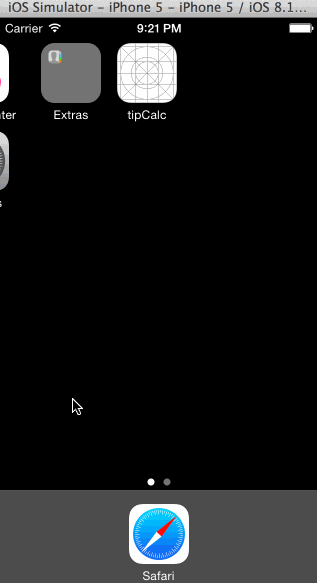

#Codepath prework - Tip Calculator
Following this link  
https://courses.codepath.com/snippets/intro_to_ios/thanks_for_applying

Time spent: 6 hours spent in total

Completed user stories:

 * [x] Required: Develop basic tip calculator with ugly UI
 * [x] Required: Augment the tip calculator app with a settings view
 * [x] Optional: UI and edge case improvement
 
Notes:

Spent some time making the UI work across multiple phone resolutions by playing around with the RelativeLayout.

Walkthrough of all user stories:

GIF created with [LiceCap](http://www.cockos.com/licecap/).
